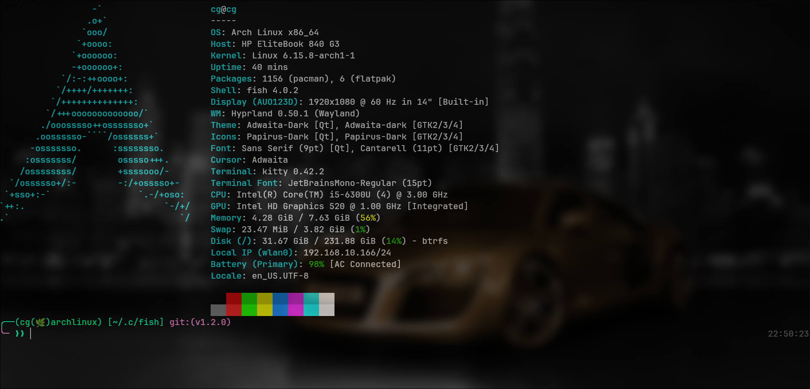

# **Cyber Green Fish Prompt** **(cg-fp)**
A fresh, clean, and personalized `fish-shell` prompt



### Requarements
- Any Linux distro (I personally use CachyOS)
- Fish shell 
- Fastfetch

### Usage
Backup and remove old-config

```bash
mkdir -p ~/fish.bak
cp ~/.config/fish/* -r ~/fish.bak
rm -rf ~/.config/fish
```

Clone
```bash
git clone https://github.com/Hadi493/cg-fish.git ~/.config/fish/
```

source
```bash
source ~/.config/fish/config.fish
```

### Aliases 
```
ll, la, cls, git_graph, g_graph, gb_graph.
sys-upgrade, full-sys-upgrade
```

### ⚠️ Important: Customize Your Aliases
Please make sure to review the ***[config.fish](./config.fish)*** file and update the aliases according to your Linux distribution.
Note: Default aliases are pre-configured for Arch-based systems.


### Customize aliases
nvim
```bash
nvim ~/.config/fish/config.fish
```


### Custom Aliases
For Debian

```bash
alias sys-upgrade="sudo apt update && sudo apt upgrade -y"
alias apt="sudo apt"
```

For Fedora
```bash
alias sys-upgrade="sudo dnf upgrade -y"
alias dnf="sudo dnf"
```
