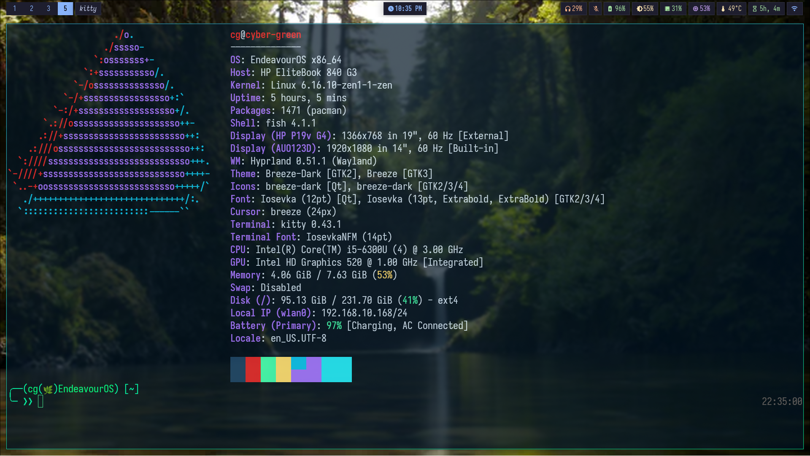

# My Fish Shell Configuration

My personal Fish shell setup with intelligent two-line prompt and productivity enhancements.



## Features

- Two-line prompt design prevents long paths from pushing cursor off-screen
- Git integration with branch names and status indicators
- Command execution timing for commands over 2 seconds
- Virtual environment detection and display
- Exit status indicators for failed commands
- Unicode styling with clean box-drawing characters
- Custom syntax highlighting and color scheme
- Smart autocompletion with case-insensitive matching
- Enhanced keybindings for productivity
- Smart cd function that lists directory contents
- Archive extraction for multiple formats
- Process search and file finder utilities

## Installation

### Quick Install
```bash
curl -fsSL https://raw.githubusercontent.com/Hadi493/fish-config/main/install.sh | bash
```

### Manual Install
```bash
git clone https://github.com/Hadi493/fish-config.git
cd fish-config
./install.sh
```

## Dependencies

### Required
- Fish shell 3.0+
- Git
- Nerd Font (recommended: Iosevka)

### Optional
- tree - Enhanced directory listing
- bat - Better cat with syntax highlighting
- curl - Weather function

## License

MIT License

### Requarements
- Any Linux distro (I personally use CachyOS)
- Fish shell 
- Fastfetch

### Usage
Backup and remove old-config

```bash
mkdir -p ~/fish.bak
cp ~/.config/fish/* -r ~/fish.bak
rm -rf ~/.config/fish
```

Clone
```bash
git clone https://github.com/Hadi493/cg-fish.git ~/.config/fish/
```

source
```bash
source ~/.config/fish/config.fish
```

### Aliases 
```
ll, la, cls, git_graph, g_graph, gb_graph.
sys-upgrade, full-sys-upgrade
```

### ⚠️ Important: Customize Your Aliases
Please make sure to review the ***[config.fish](./config.fish)*** file and update the aliases according to your Linux distribution.
Note: Default aliases are pre-configured for Arch-based systems.


### Customize aliases
nvim
```bash
nvim ~/.config/fish/config.fish
```


### Custom Aliases
For Debian

```bash
alias sys-upgrade="sudo apt update && sudo apt upgrade -y"
alias apt="sudo apt"
```

For Fedora
```bash
alias sys-upgrade="sudo dnf upgrade -y"
alias dnf="sudo dnf"
```
